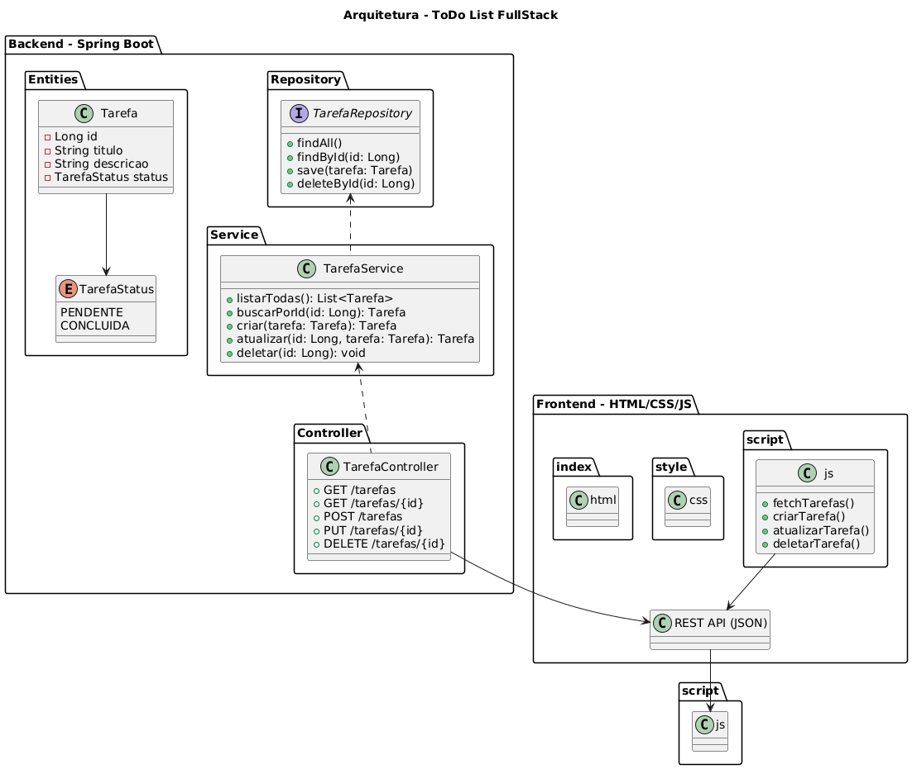

# ToDo List FullStack

Projeto **FullStack** de gerenciamento de tarefas (ToDo List), desenvolvido com **Java (Spring Boot)** no backend e **HTML/CSS/JavaScript** no frontend.  

## Funcionalidades
- Criar tarefas  
- Listar tarefas  
- Atualizar tarefas  
- Deletar tarefas  
- Integração completa entre frontend e backend via **REST API**  

## Tecnologias Utilizadas
### Backend
- Java 17  
- Spring Boot  
- Spring Data JPA  
- H2 Database (para testes)  

### Frontend
- HTML5  
- CSS3  
- JavaScript (Fetch API)  

## Estrutura do Projeto

```
todolist/
├── backend/
│ ├── src/main/java/com/example/todolist
│ │ ├── entities/Tarefa.java
│ │ ├── entities/TarefaStatus.java
│ │ ├── repositories/TarefaRepository.java
│ │ ├── services/TarefaService.java
│ │ └── controllers/TarefaController.java
│ └── resources/application-teste.properties
└── frontend/
├──── index.html
├──── css/style.css
└──── js/script.js
```

## Arquitetura
O projeto segue o padrão **MVC (Model-View-Controller)**.  



## Como Executar
Backend
- Clone o repositório
- Entre na pasta ``backend/``
- Rode o projeto com: ``./mvnw spring-boot:run``
- Api disponível em: ``http://localhost:8080/tarefas``
Frontend
- Abra o arquivo ``index.html`` no navegador
- O fronted irá consumir automaticamente a API do backend

## Licença
Projeto desenvolvido para fins de estudo


